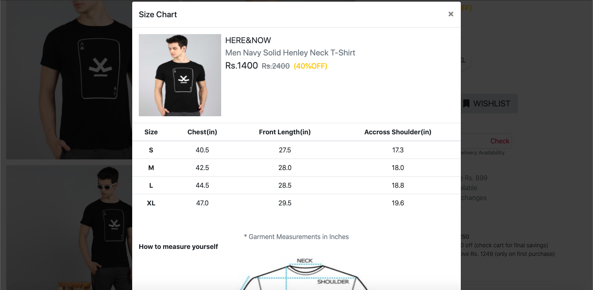

# Product Zoom-in with Rating and Reviews
E-commerce Product Zoom feature on product pages has become increasingly popular.This feature allows visitors to zoom in on specific details on the product image and to get a feel for the product, thus diminishing the gap between e-commerce sites and physical stores.

### 1.Product Specification

### 2.Product Zooming

### 3.Product Size Chart

### 4.Product Rating

### 5.Product Reviews

### 6.Mobile Responsive

